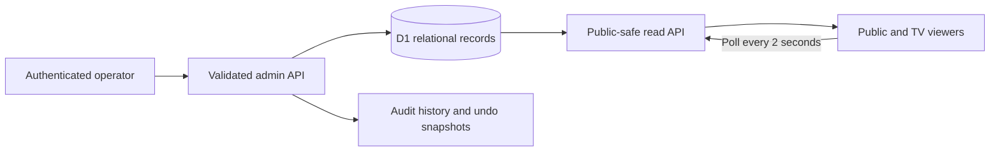

# Edwards County Calcutta — review build

Status: functioning local review application; no production deployment authorized or performed.

Open the [public board](http://localhost:5173/), [operator console](http://localhost:5173/admin), or [TV view](http://localhost:5173/tv) while the local preview server is running. The original demo contains 12 fictional two-person teams, two flights, five buyers, five completed sales, and Hayes / Bennett on the block at $1,250. Gross pool: $4,950; demonstration house share: 10%; net pool: $4,455.

## Architecture

The standard Sites Vinext/React starter builds a Cloudflare Worker. Public and admin routes share presentation components but have separate server endpoints. Data lives in normalized D1 tables; browsers never own auction records. Currency uses integer cents and ownership/payout percentages use integer basis points. Largest-remainder allocation reconciles payout and ownership splits to the cent.

Database tables: events, flights, teams, players, buyers, auction_state, sales, ownership, payout_rules, audit, operators, mutation_guards. Teams support one to four players. Event settings are configuration JSON; the tournament, teams, players, sales and ownership are separate relational records. Audit before/after snapshots are used for undo, not as the primary event store.

Every auction mutation checks the expected event revision inside a D1 batch. A failed check rolls the batch back. The SOLD workflow also checks the exact team, buyer and amount shown in confirmation. A partial unique index permits only one active sale per team. Repeated sale request IDs return the prior success without adding another sale.

## Operator workflow

1. Create an event and add flights under Setup & rules.
2. Enter teams with Quick add, the full editor, or a spreadsheet/CSV preview. Full editor changes remain possible after import. Reorder by dragging, arrows, sorting or auction position; filter or bulk-assign flights.
3. Add buyers or syndicates; contact information and notes remain private. Buyers can also be created directly in the console.
4. Start the auction. Record bids by keyboard or quick increments; use **Hammer / sold**, then the short confirmation. The next team advances automatically when enabled.
5. Use Sales & buybacks for price/buyer corrections, reopening/voiding sales, and partial or full allowed team buybacks. Use Undo last action to restore the preceding auction state. Completed buybacks never add to gross or net pools.
6. Complete the auction, enter finishing positions, and export auction records or calculated entitlements. Resolve ties before recording unique positions within each payout pool. No golf scoring system or payment processing is included.

Console shortcuts: B focuses bid entry; Enter records the bid; + applies the minimum increment; S opens sale confirmation; U opens undo confirmation. Shortcuts are suppressed while editing text or a dialog is open. Full screen removes setup chrome from the console.

Rules support separate flight pools, one combined pool, or custom shared/independent flights. House share can be zero, percentage, or a fixed event amount allocated proportionally across pools. Each payout schedule must total 100%. Buyback ownership limits, proportional or fixed consideration, and deadline are configurable. The simple ownership model has a purchaser/syndicate and the team; optional subdivisions among syndicate members are not included.

Withdrawals after sale require an explicit sale void/reopen first. Flight changes move active sale contributions into the new pool. Changing pool membership after finishing positions exist requires clearing those positions first, preventing duplicate awards. Auction order and private data are excluded server-side when their public display settings are off.

## Live updates and display

Public clients poll every two seconds. Unchanged revisions return 204 with no payload. Bid-only changes return only current event/block state; board changes fetch a fresh public snapshot. A separate board revision keeps bid updates small, including for a 100-team event. Reads use authoritative D1 snapshots. The interface preserves the last display and shows Reconnecting during an outage; it refreshes when the connection returns.

The public board includes the current team/bid/buyer, aggregate and flight pools, projected or final purses, recent sales, searchable flight/status team cards, and house rules. Mobile prioritizes the block, bid, buyer, pool and recent sales. The 1920 × 1080 TV view fits the current team, next teams, totals and recent sales in the viewport.

## Authentication and access

The hosted application uses Sites' dispatch-owned Sign in with ChatGPT. Every admin page/API checks authenticated identity server-side. ADMIN_EMAILS is a hosted secret containing the requested owner address, tlriisoe@gmail.com. Anonymous public viewing is supported by the application; the eventual Sites audience must also be set public when publication is approved.

The owner can add and revoke other operators in the Access tab. Added operators are stored separately in D1, cannot change access, and do not become owners. Revocation takes effect on the next request. An empty owner allowlist grants no owner access.

The local Sites starter simulates sign-in as seedy@sites.test, explicitly labelled in the operator interface. The local .env is ignored by Git and packaging. This simulation is development-server middleware; it is not part of the built production Worker. Actual ChatGPT sign-in and dispatch header protection must be checked on the first approved hosted deployment.

## Validation performed

- TypeScript checking and the Vinext Worker build passed.
- 58 local HTTP/domain acceptance checks passed, covering creation, flights, quick/full/bulk teams, bids, public updates, sales, advancement, buybacks, corrections, undo, persistence, privacy, CSRF, forged local headers, concurrent operators, payout validation, combined/custom pools, deadlines, 100-team data, and demo reset/restore.
- 500 randomized cent-exact payout allocations passed.
- Two independent browser tabs verified automatic bid propagation and team advancement after SOLD. Browser import preview, import completion and undo were exercised with disposable fictional teams and restored afterward.
- Public layouts inspected at 390 × 844, 768 × 1024 and desktop sizes; operator tablet/desktop layout and 1920 × 1080 TV mode reviewed. TV content fits exactly within the 1080p viewport. Mobile viewport metadata and console density issues found during inspection were fixed.
- Stopping the local server preserved the current public display with Reconnecting. Restarting recovered automatically without viewer refresh. The original 12-team demo, $1,250 current bid and $4,950 gross pool survived restart.
- The WebMCP public read tool registered, returned authoritative safe state, refreshed the visible board, and rejected unexpected input.

The local rehearsal is not a hosted load test, a real multi-user ChatGPT authentication test, or verification of D1 provisioning/redeployment. Those need the first approved deployment. No production database was created or seeded through deployment, and no public deployment was performed. Saving a Sites version stores the source/build for review; it does not create a separately hosted staging preview.

## Product references

House-rule flexibility reflects published club examples, including [Kennedy Men's Club's half-interest buyback rule](https://kennedymensclub.com/docs/page/localrules) and [South Suburban's per-flight purses and expense deduction](https://www.ssgolfclub.org/calcutta). The separation of operator and display screens is informed by [Wavebid's auctioneer screen](https://support.wavebid.com/hc/en-gb/articles/360013931057-Auctioneer-Screen). This application's interface and implementation are original.
