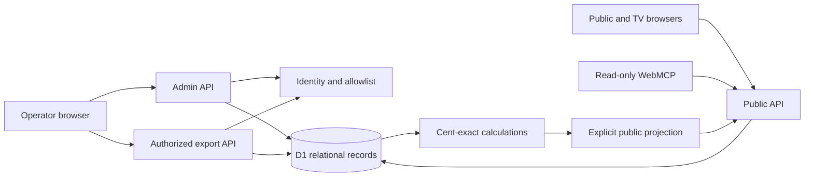

# Current architecture

Originally verified against `dfab14906c04b5a6d99ffffbfba4249883750eae`, updated for approved Batch A commit `4dc2900` on 2026-09-14 UTC. This describes the implementation, including exceptions; it is not a replacement design.

## Runtime and boundaries

The Sites starter runs React 19 through Vinext/Vite and builds a Cloudflare Worker. D1 is bound as `DB`. The package lock and Sites execution-profile helpers are part of the build context; this Windows checkout uses the portable execution profile. There is no R2 dependency or external payment service in this product.

| Area | Actual files and responsibility |
|---|---|
| Route shells | `app/page.tsx`, `app/admin/page.tsx`, `app/tv/page.tsx` render the shared auction application with appropriate mode. |
| Shared client | `app/auction.tsx`: polling, current event, public/TV block, pool cards, field filters and read-only WebMCP. |
| Operator | `app/operator.tsx`, `app/auction-controls.tsx`, `app/editors.tsx`, `app/rules.tsx`: console, staged Sold confirmation, editors, setup/results. |
| Settlement | `app/settlement.tsx`, `lib/settlement.ts`: manual entries, party balances, separate receipt/payable views. |
| Sharing/help | `app/sharing.tsx`, `lib/sharing.ts`: origin-derived event URLs, QR generation, guide/checklist. |
| Admin API | `app/api/admin/route.ts`: origin/identity checks, Zod validation, revisions, writes and audit/undo. |
| Read/export APIs | `app/api/public/route.ts`, `app/api/export/route.ts`: public projection or authorized export, respectively. |
| Storage/domain | `lib/store.ts`, `lib/model.ts`, `lib/exports.ts`: parameterized SQL, identity, read snapshots, allocation, entitlements and serialization. |
| Schema | `db/schema.ts`, `drizzle/0000_tough_anita_blake.sql`, `drizzle/0001_normal_magdalene.sql`. |

## Relational model

Fourteen tables exist. `events` owns flights, teams, buyers, auction state, sales, payout rules, audit and settlement records. `players` belongs to teams; `ownership` belongs to sales. `operators` is an application-wide email allowlist; `mutation_guards` enforces transactional preconditions.

| Tables | Purpose and integrity |
|---|---|
| `events`, `flights`, `teams`, `players` | Event configuration, flight grouping, ordered lots, player rows and finishing positions. |
| `buyers`, `auction_state` | Purchaser records and current team/bid/optional bidder/pause state. |
| `sales`, `ownership`, `payout_rules` | Retained sale history, one ACTIVE sale per team, ownership in basis points, ladders per pool. |
| `audit`, `mutation_guards` | Actor/action/before-snapshot/undo metadata; CHECK-based revision gate. |
| `operators` | Explicit owner-managed additional operator emails; owners come from environment configuration. |
| `settlement_payments`, `payout_disbursements` | Signed integer-cent entries, party/event foreign keys and unique reversal references. |

The second migration adds settlement tables; it does not rewrite the original schema. Both migrations already exist in the review database. Do not replay them there. Audit fixtures use a fresh isolated database with both applied. The audit makes no migration.

`read()` batches eleven queries for a consistent event snapshot, joins player/ownership records, normalizes settings and derives totals and settlement. Admin GET separately returns event choices, recent audit metadata (limit 100), identity and owner-only operator list. A full backup includes complete audit rows/snapshots and private event data, so it is larger and more sensitive than a public payload.

## Calculations

`compute()` uses ACTIVE sales, configured separate/combined/custom membership, and none/percentage/fixed house deductions. Fixed deductions distribute proportionally across gross pools. `splitCents()` uses largest remainders with stable tie order. Payout ladders and completed ownership each reconcile their available cents. Results map place awards to ownership entitlements; unpaid obligations are derived independently from disbursements.

`settlement()` groups auction purchases/receipts by buyer and entitlements/disbursements by buyer or team. Reversals are signed entries. Current aggregation sums signed balances across parties: that makes net position appear as remaining collection, documented as CAL-P1-005. Exact stored cents and per-party history remain intact.

## Mutation sequence and exceptions

For routine event actions, POST verifies exact Origin, operator identity, JSON content type, body size and a UUID request ID. It checks duplicate audit ID/event and the expected revision, then builds one D1 batch containing a `mutation_guards` CHECK insert, revision increments, normalized record changes and audit. A concurrent revision mismatch cannot commit a partial routine mutation. Sale validation also confirms current team, exact staged amount, event/pause status and final purchaser. A unique active-sale constraint is an independent protection.

`revision` advances for event mutations. `boardRevision` advances except for bid-only changes. Both guard and audit entries use the request ID; routine replay returns duplicate success without duplicating the sale/payment. Event creation and demo creation occur before this common path and are not request-idempotent (CAL-P2-002); do not describe all application writes as idempotent.

Access changes also precede the routine event path, but Batch A validates the audit event and batches audit plus allowlist change atomically. Matching audit UUID/actor/action/email/event returns duplicate success without reapplying an older grant/revoke; changed request content is rejected. A concurrent unique-ID conflict is rechecked against the committed audit record. Omitted event context resolves an existing event; no-event access changes are rejected. Access is global and does not increment an auction revision. Owner authorization runs before replay. Fault-injected local D1 tests prove rollback in both directions; see [BATCH-A.md](BATCH-A.md). This uses the documented [D1 batch transaction behavior](https://developers.cloudflare.com/d1/worker-api/d1-database/#batch).

Undo restores the latest eligible event action from its before-snapshot through normalized statements in one batch. Auction undo retains current settlement history. Settlement undo/reversal appends compensating entries rather than erasing originals. Demo reset requires an exact phrase and can be undone; this is not a general backup restore/import facility.

## Authentication, authorization and privacy

The Sites ChatGPT identity helper consumes dispatcher-owned identity headers. `identity()` normalizes email, checks owner emails from `ADMIN_EMAILS`, and reads the operator allowlist for each request. Owner-only access changes are checked on the server. Public reads do not need login. Admin reads, writes and every export require operator authorization.

Local mock sign-in belongs to the starter's dev dispatcher, which strips forged inbound identity headers. Local tests established anonymous denial, forged-header denial and cross-origin rejection in that dispatcher. They do not establish the hosted dispatcher's trust boundary. A standalone Worker must not be assumed safe for direct public exposure without the Sites identity boundary. No secret values or local auth cookies are stored in these docs/reports.

Zod object schemas choose writeable fields; SQL uses parameter bindings. A fresh probe confirmed that supplied team `status`, `eventId` and `finish` fields were stripped from an editor payload. JSX renders names/notes as text in inspected paths; no raw HTML insertion was found there. This is a bounded source review, not a penetration-test certification.

Public payloads are explicit projections. Buyer contacts/private notes, private team notes, payment history, audit and allowlist data are excluded. Public team notes are intentionally public. Display settings remove hidden prices/buyers/handicaps/pool fields server-side. Standard exports omit buyer contacts/private notes, but **all exports are authorized reports**, not anonymous downloads: ownership exports include private agreement consideration; payment history includes notes/actors; JSON backup includes private data.

## Polling, navigation and WebMCP

Clients poll every two seconds. Unchanged public versions return 204; a bid-only change returns a small current-state payload through a five-query read, while board changes return a full public projection. In-flight/generation guards prevent applying obsolete event responses. Errors retain the last board and show Reconnecting; browser online events request a fresh snapshot. The isolated restart test demonstrated automatic viewer recovery.

The browser initializes selection from the query string and handles `popstate`. Selecting or creating an event updates browser history; a newest-event fallback pins the resolved ID with `replaceState`. A shared `eventPath()` retains encoded IDs in brand/public/TV/operator and authentication return links. Event changes synchronously invalidate the polling generation and clear old data/drafts before loading the next snapshot; writes wait for loading to finish. Reload/back/forward, dirty rules and a deliberately delayed old response passed browser checks, resolving CAL-P1-001 locally.

`read_auction_board` is the sole WebMCP tool observed. It accepts no properties, rejects unexpected inputs and calls the public API; read-only and untrusted-content annotations are present. It may be registered while on admin, but returns only the public projection. There is no page tool for bidding, selling, access changes or settlement.

## Boundaries needing later evidence

Hosted real-user sign-in/allowlist revocation, anonymous internet access, deployment migrations and persistence are BLOCKED by the absence of an approved deployment. Maximum configured capacity (500 teams), long-running audit retention, regional latency and many simultaneous clients are UNVERIFIED. Observed 100-team results are in [VALIDATION.md](VALIDATION.md). Avoid replacing the architecture to address those unknowns.
